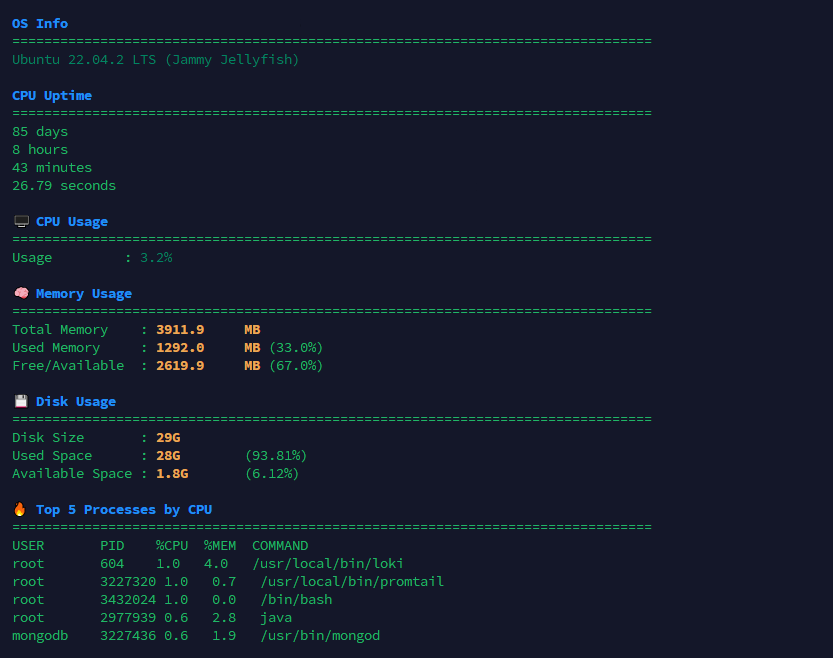
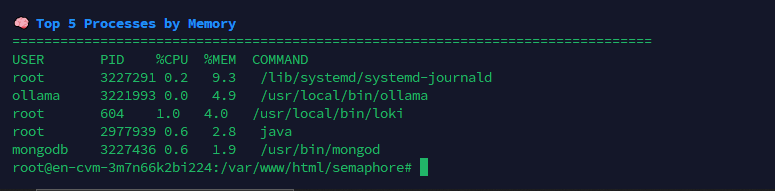

# 🖥️ System Health Check Script

A Bash script to monitor Linux system health including:

- OS Info
- CPU Uptime and Usage
- Memory Usage
- Disk Usage
- Top 5 CPU and Memory consuming processes

## 📦 How to Use

```bash
chmod +x health-check.sh
./health-check.sh


## 📸 Sample Output

### 🖥️ Terminal View 1


### 📊 Terminal View 2

